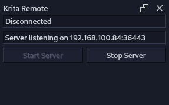

# Krita Remote

Krita Remote is a Python extension that allows Krita to be remotely controlled over a network connection. It does this by exposing the Krita API as a WebSockets server using PyQt5's QtWebSockets library.

The PyQt5 version that is included in the official Krita appimage does not come with QtWebSockets, so the Krita distribution that is in nixpkgs is used instead, and can be accessed in this repository's flake.nix devShell. A Nix overlay is applied so that QtWebSockets is available with PyQt5



## Usage

You need ``nix`` (with flakes enabled) to build a version of the ``nixpkgs`` distribution of Krita, but with QtWebSockets. This will happen automatically when entering the devShell:

```
$ nix develop --impure
```

Copy ``krita_remote.desktop`` file and the ``krita_remote`` folder to your Krita python plugin folder.

Run the proof-of-concept remote web UI server in a separate terminal and navigate to it in your browser:

```
$ python -m http.server -d ./client
```

Run Krita, (probably with [nixGL](https://github.com/nix-community/nixGL), though in some situations it is not necessary)

```
$ nixGL krita
```

The WebSocket server is controlled in the Krita Remote docker, press the start button to start it, and then copy-paste the address displayed in the docker into the remote web UI (tap anywhere on the UI to open the connection dialog)

## Note

I'm not proficient in the conventions for developing in Python nor Qt, much less PyQt5. Tips welcome.

## Acknowledgements

Thank you wojtryb for publishing a [Python Krita API wrapper with typing](https://github.com/wojtryb/Shortcut-Composer/tree/main/shortcut_composer/api_krita)

Thank you robrodricks for the easy-to-use [vue3-touch-events](https://github.com/robinrodricks/vue3-touch-events) plugin