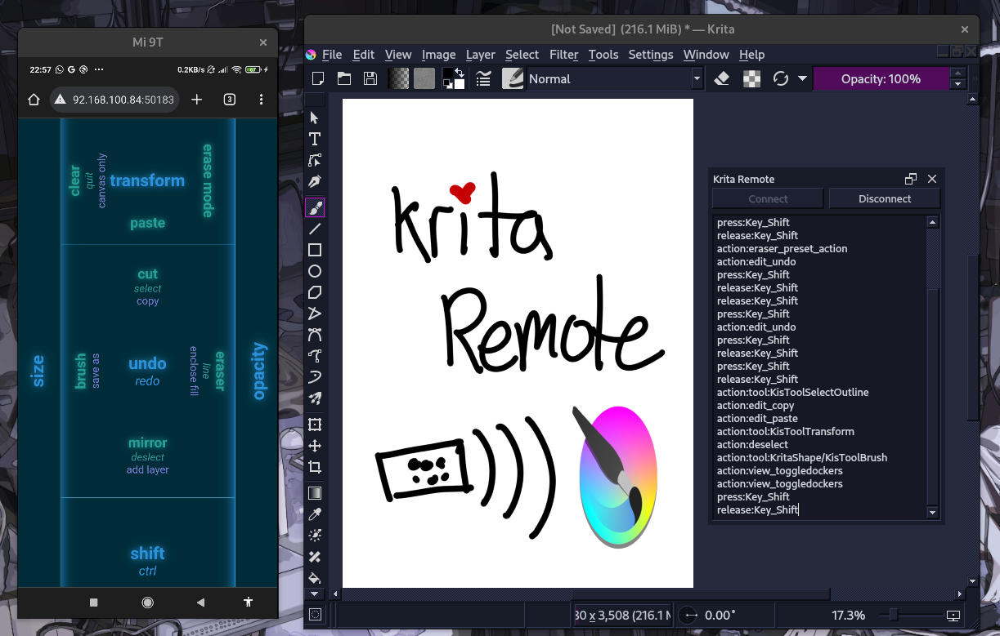

# Krita Remote

Krita Remote is a Python extension that allows Krita to be remotely controlled over a WebSockets connection. It does this using PyQt5's QtWebSockets module.



However, the official Krita download does not come with QtWebSockets, so this repository supplies a so-called `nix` overlay that makes it easy for Linux users to compile a custom version of Krita on your own computer, with the QtWebSockets module enabled.

This extension also supplies a webapp to use on your phone. By performing directional flick gestures on the webapp, you can remotely control Krita via the Krita Remote extension, and trigger actios such as Undo, Copy/Paste, switching to Brush, Eraser, resizing, even keyboard keys like Shift, Ctrl can be triggerd. etc. The webapp is designed with large target areas, so that very specific gestures can be performed accurately without your direct line-of-sight to the touchscreen.

## Requiremets

This extension is impractical to install. But if the idea of using QtWebSockets in Krita Python extensions fascinates you as much as me, then these are the requirements you'll need to get yourself hooked up:

 - `nix`, which you can install on most Linux distros with the Determinate Systems [nix-installer](https://github.com/DeterminateSystems/nix-installer)
 - Enough disk space and time to compile Krita (in my experience, 10+ GB of disk space and a couple hours on my laptop)

## Usage

Download this repository. Copy `krita_remote.desktop` file and the `krita_remote` folder to your Krita Python extensions folder `pykrita`.

`nix` will automatically compile Krita with QtWebSockets enabled when entering this repository's development shell, which you can do by invoking `nix` like so:

```
$ nix develop --impure
```

> [!WARNING]
> That command will take a couple hours to complete, but only if it's the first time you run it

Once completed, Krita will be available on the development shell's $PATH, and can be run like so (probably with [nixGL](https://github.com/nix-community/nixGL), though in some situations it is not necessary(?)).

```
$ nixGL krita
```

## Krita Docker

The WebSockets server is started through the Krita Remote docker, press the Connect button to start it and display a QR code to scan with your phone to open the client.

> [!NOTE]
> The QR code is generated by *directly* calling an online API, therefore an internet connection is needed (Does anyone know a better way to get QR codes generated in Krita Python extensions? Please?)

> [!WARNING]
> Transport Layer Security is unsupported, don't scan the QR code on untrusted WiFi (such as public WiFi access points).

The Krita Remote docker also displays an event log.

## Client

The client (ie, the remote control) is a simple Vue webapp that is served using Python's built-in HTTP server, which is also started in Krita by the Python extesion. The Vue webapp uses a modified version of [vue3-touch-events](https://github.com/robinrodricks/vue3-touch-events) for detecting touchscreen gestures and triggering handlers.

 - tap
 - drag
 - press
 - release
 - swipe (top/bottom/left/right)
 - flick (top/bottom/left/right), this is a directional swipe gesture that is followed immediately by a swipe gesture back to where you started, without releasing your finger.

I have added basic multi-touch gestures, so different handlers can be triggered for touch gestures that are performed with more than one finger (it only discerns multi-finger gestures from single-finger gestures, so using 2 or more fingers trigger the same handler)

 - multitap
 - multipress
 - multirelease
 - multiswipe
 - TODO: multidrag
 - TODO: multiflick

 This client is just an experimental proof-of-concept. It doesn't even have to be a webapp, anything that can connect to WebSockets are just as capable.

 ## WebSockets Server

 The server is a WebSockets server that runs in Krita in the Python Extension object. It listens for messages sent to the socket in the format `<type>:<value>`. The following messages are supported:

 - `action:<Krita action name>`, eg `action:edit_undo` will trigger the Undo action
 - `action:tool:<Krita tool name>`, eg `action:tool:KritaShape/KisToolBrush` will activate the Freehand Brush Tool
 - `press:<Qt key name>`, eg `press:Key_Space` will inject a Space press event in the current canvas
 - `release:<Qt key name`, eg `press:Key_Space` will inject a Space release event in the current canvas

WebSockets is a two-way communication protocol, however this extension only listens for messages. Nothing is sent back to the remote.

> [!WARNING]
> Transport Layer Security is unsupported, don't run the WebSockets server on untrusted WiFi.

## Note

I'm not proficient in the conventions for developing in Python nor Qt, much less PyQt5, but I'm open to learning more. Please teach me!

## Acknowledgements

Thank you wojtryb for publishing a [Python Krita API wrapper with typing](https://github.com/wojtryb/Shortcut-Composer/tree/main/shortcut_composer/api_krita)

Thank you robrodricks for the easy-to-use and easy-to-modify [vue3-touch-events](https://github.com/robinrodricks/vue3-touch-events) Vue plugin. Without your work, I would not have bothered developing this Krita extension.